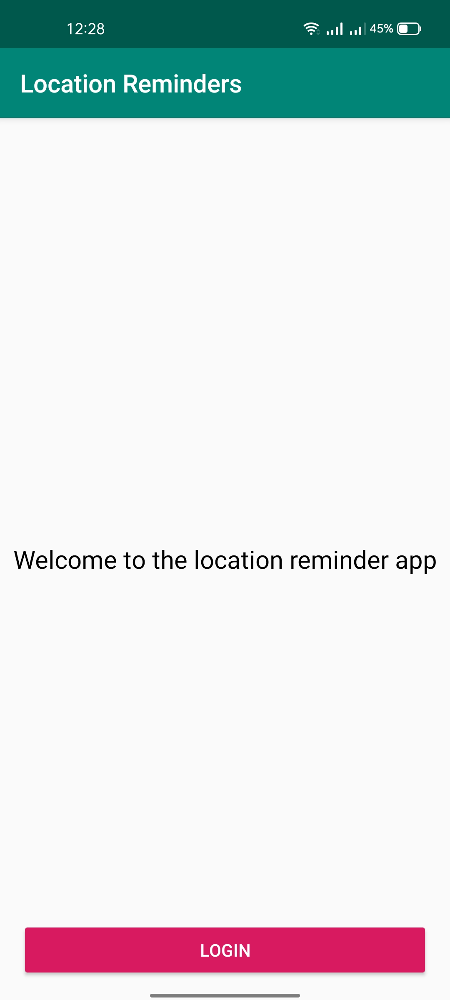
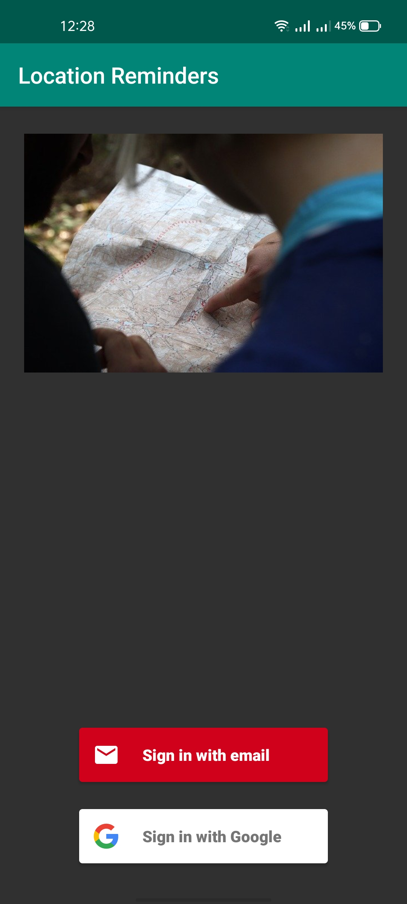
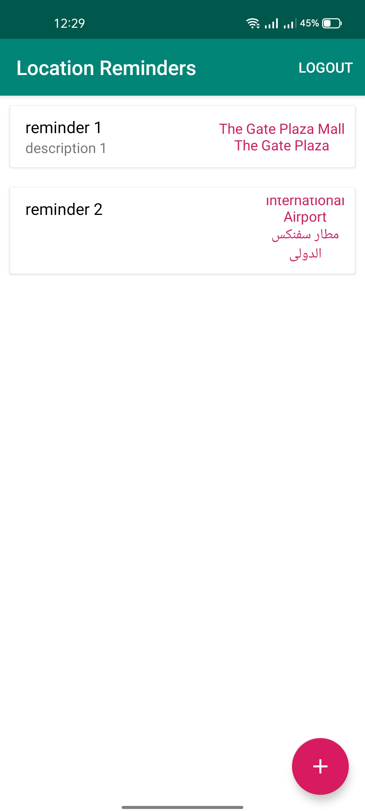
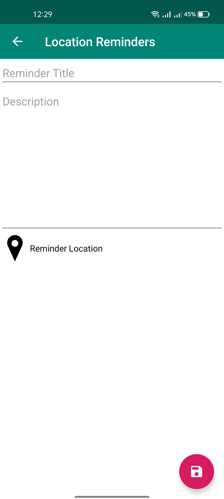
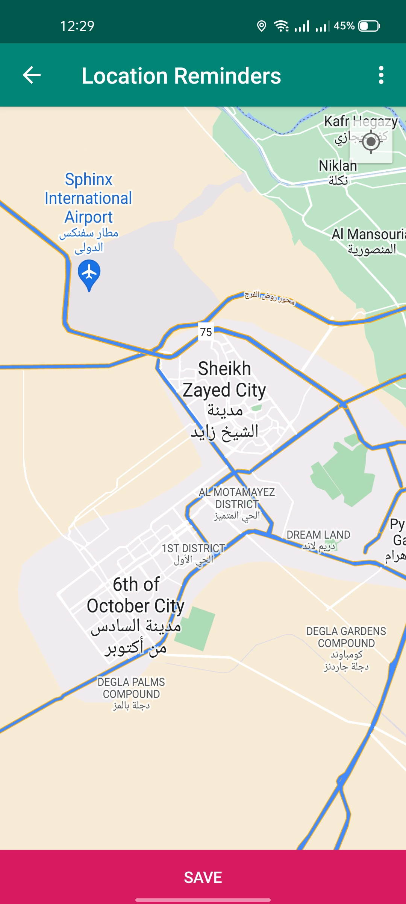

# Location Reminder

A Todo list app with location reminders that remind the user to do something when he reaches a specific location. The app will require the user to create an account and login to set and access reminders.

### Some of the Technologies and Techniques Used
The app follows the MVVM Architecture Pattern and makes use of the following libraries.

- LiveData 
- ViewModel 
- Databinding
- RecyclerView
- Notification
- Firebase Auth
- Room Database
- Geofencing API
- JobIntentService
- Kotlin Coroutines
- Google Maps API
- UI and Unit Testing
- Mockito and Espresso 
- Firebase Authentication
- Navigation Component
- Dependency Injection Koin

## Screenshots

 

 

 

 

 

 

 

### Udacity Review
